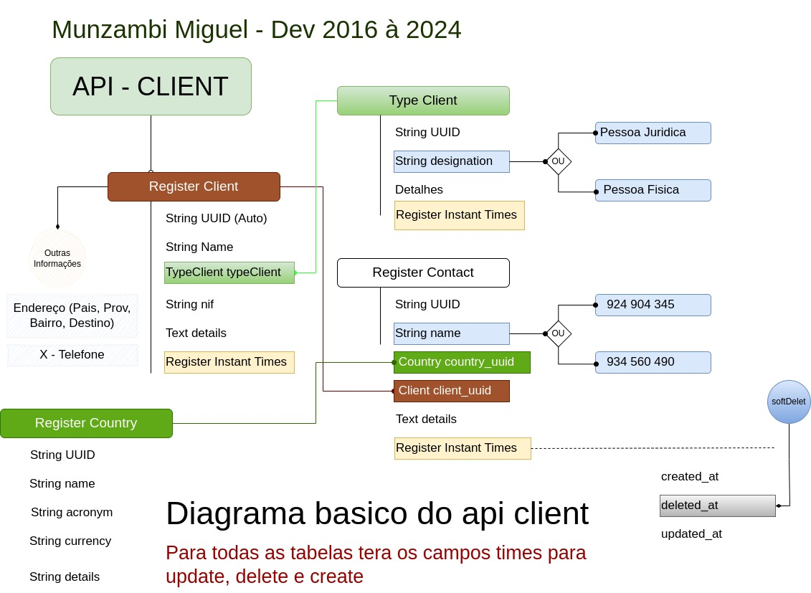

# API - Cliente Spring Boot java

Sou Munzambi Ntemo Miguel e estou contribuindo para o crescimento da comunidade. Aqui está um exemplo básico de uma API cliente feita no Spring Boot, com Swagger. No entanto, os critérios de segurança ou JSON Web Token não foram implementados. Foi feito um resumo da orientação a objetos e das classes genéricas. Farei com que o projeto seja bem documentado, de modo que qualquer pessoa possa entender como foi desenhado e como cada classe funciona neste pequeno projeto.

